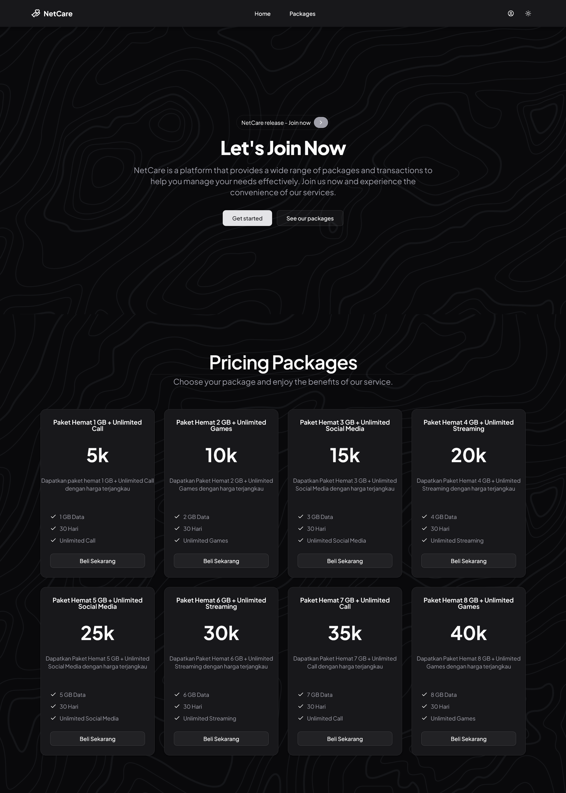
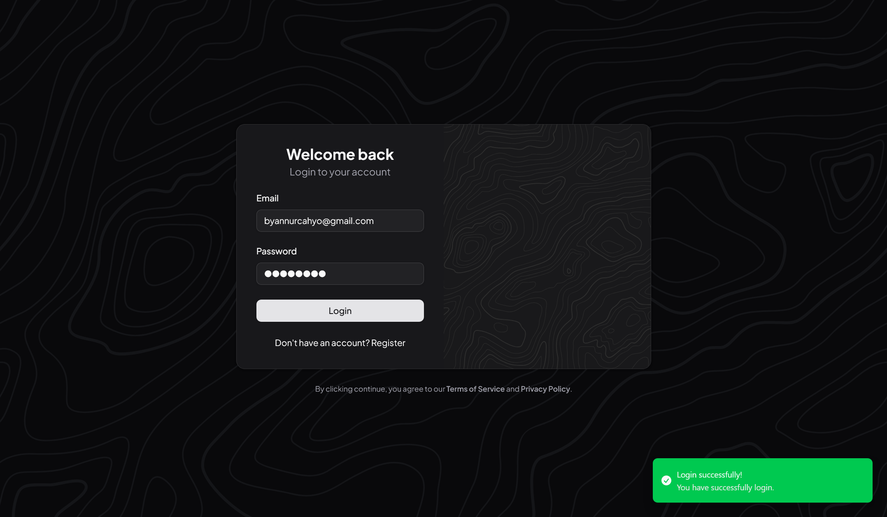
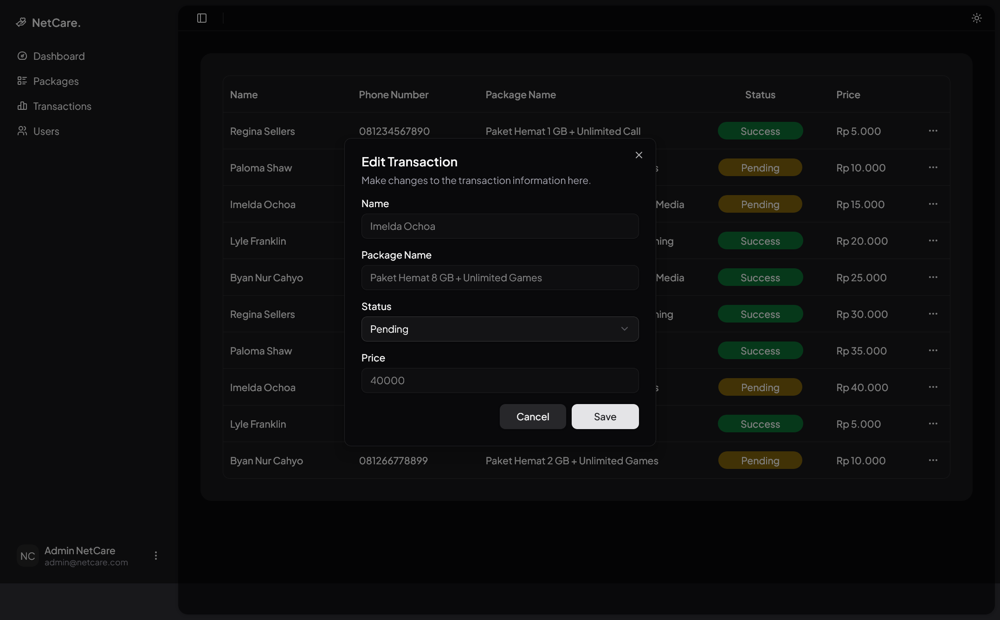

# NetCare - Internship Test

Welcome to **NetCare**, a mini project submission for internship. NetCare is a simplified internet package purchasing application, allowing users to register, login, view available packages, and make transactions. Admins can manage users and view all transactions.

---

## Features

-   **User Authentication**
    -   Login system with role-based access control
    -   Supports both `admin` and `user` roles
-   **Package Listings**
    -   Show available internet packages with data, bonus, duration, and price
-   **Transaction System**
    -   Users can purchase packages
    -   Transactions include phone number, package, status, and date
-   **Admin Features**
    -   View all users
    -   View all packages
    -   View all transactions

---

## Installation

Clone this repository

```bash
git clone https://github.com/byannurcahyo/NetCare.git
```

Go to the directory

```bash
cd NetCare
```

Install the dependencies

```bash
bun install
```

Create .env

```bash
cp .env.example .env
```

Build the app

```bash
bun run build
```

Run the server API from `json-server`

```bash
bun serve
```

Finally run the app with the command below

```bash
bun preview
```

Open your browser and go to `http://localhost:4173` to access the application.

## Dummy Login Credentials

Berikut adalah akun dummy yang dapat digunakan untuk mengakses aplikasi **NetCare** selama proses pengujian atau demonstrasi. Data hanya digunakan untuk keperluan lokal/testing.

### Admin

-   **Email:** admin@netcare.com
-   **Password:** 12345678

### User (Example)

-   **Email:** byannurcahyo@gmail.com
-   **Password:** 12345678

### Notes

-   Semua password dummy diset ke `12345678`.
-   Anda dapat melihat daftar lengkap user dummy di file `db.json`

## Screenshots

1. Landing Page
   

2. Login Page
   

3. Admin Page
   
